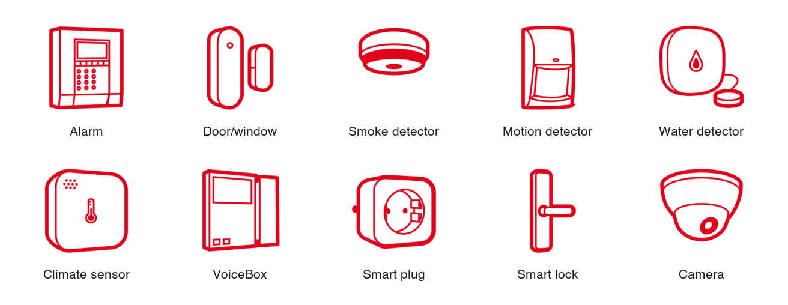
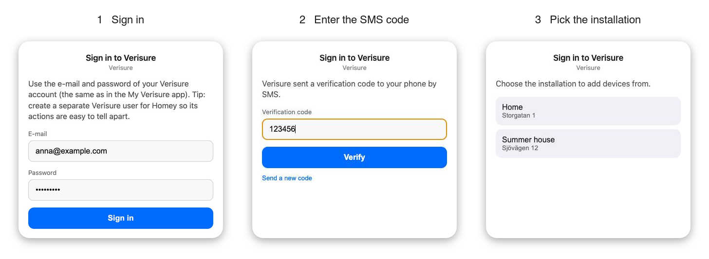
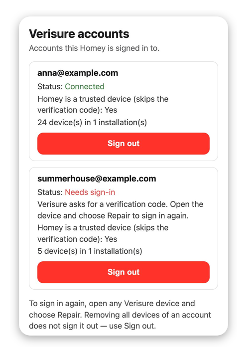
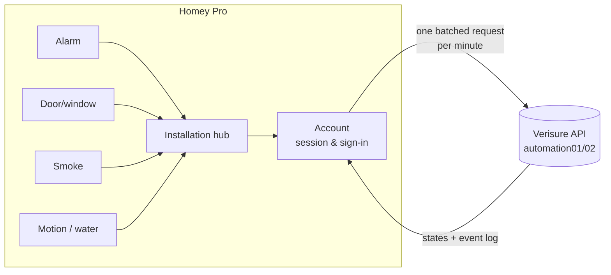
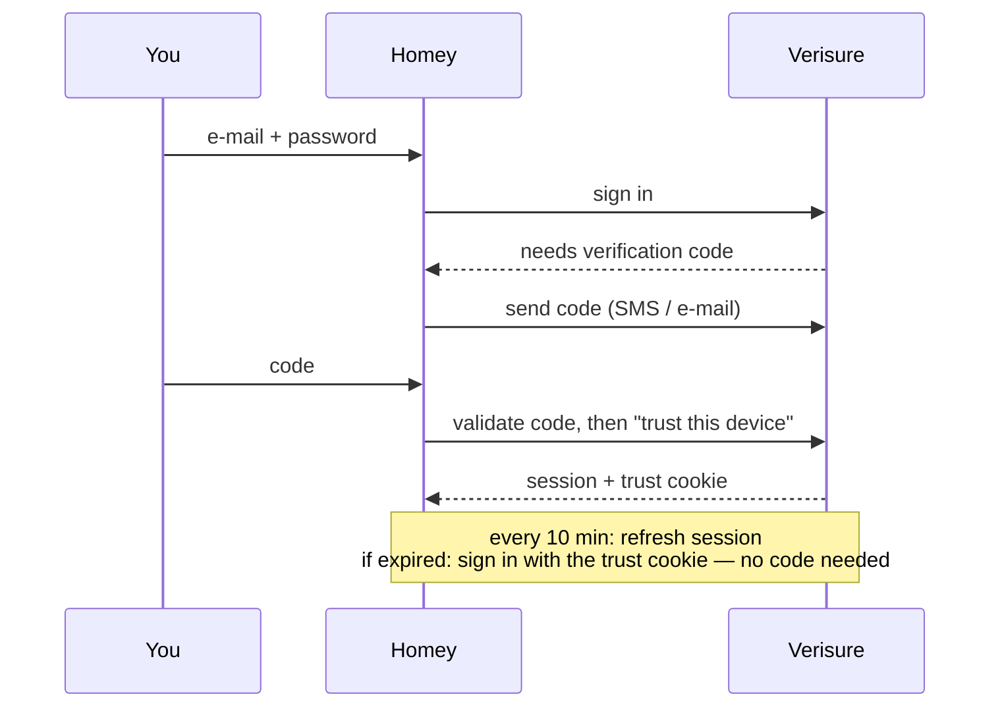

<p align="center">
  
</p>

<p align="center">
  <a href="LICENSE"></a>
  
  
  
  <a href="https://buymeacoffee.com/mikeswe"></a>
</p>

<p align="center">
  <b>Bring your Verisure alarm into Homey.</b><br>
  Arm and disarm from Flows, know who changed the alarm, react to open doors, smoke, water leaks,
  intrusions, tampering and low batteries — and check that every window is shut before you leave.
</p>

---

> **Unofficial app.** Verisure for Homey is a community project. It is not made, endorsed or
> supported by Verisure. It talks to the same Verisure app API that the Home Assistant integration uses.

## ✨ Highlights

| | |
|---|---|
| 🔐 **Two-factor sign-in that stays signed in** | Enter the SMS or e-mail code once. Homey becomes a *trusted device* and signs itself in again whenever needed — no more pressing "Login" every morning. |
| 🛡️ **Full alarm control** | Arm away, arm home, disarm, force arm past an open window, or use a personal code per Flow so Verisure logs *who* did it. |
| ✅ **"Can the alarm be armed?"** | Asks Verisure — without arming — whether arming would go through, and tells you exactly which door or window is in the way. |
| 🔥 **Detectors** | Smoke, water leak, motion, tamper and low-battery alarms, plus door/window open and closed — even short openings between two updates. |
| 🔌 **Smart home devices** | Smart plugs, smart locks, cameras, temperature and humidity from smoke detectors, sirens and climate sensors. |
| 🐢 **Gentle on your account** | One request per minute for the whole installation, with automatic back-off — Verisure blocks accounts that ask too often. |
| 🧱 **Built on proven code** | A port of [`python-verisure`](https://github.com/persandstrom/python-verisure), the library behind Home Assistant's Verisure integration, tested against a live installation. |

## 📚 Contents

- [Supported devices](#-supported-devices)
- [Getting started](#-getting-started)
- [Devices in detail](#-devices-in-detail)
- [Flow cards](#-flow-cards)
- [Flow examples](#-flow-examples)
- [How it works](#-how-it-works)
- [FAQ and troubleshooting](#-faq-and-troubleshooting)
- [Limitations](#-limitations)
- [Privacy and security](#-privacy-and-security)
- [Why a new Verisure app?](#-why-a-new-verisure-app)
- [Support the project](#-support-the-project)
- [Contributing](#-contributing)
- [Credits and licence](#-credits-and-licence)

## 📦 Supported devices

<p align="center">
  
</p>

| Verisure hardware | Homey device | What you get |
|---|---|---|
| Alarm system (the installation) | **Alarm** | Arm / disarm, who changed it, ready-to-arm check, broadband status |
| Magnetic door/window contact | **Door/window sensor** | Open / closed, tamper, low battery |
| Smoke detector | **Smoke detector** | Smoke alarm, temperature, humidity, tamper, low battery |
| Camera motion detector, motion detector | **Motion detector** | Motion (while armed), tamper, low battery |
| Water detector | **Water detector** | Water leak, tamper, low battery |
| Siren, VoiceBox, climate sensor | **Climate sensor** | Temperature, humidity where available |
| Smart plug | **Smart plug** | On / off |
| Smart lock (Yale Doorman, Lockguard, Danalock) | **Smart lock** | Lock / unlock, who unlocked it, auto-lock |
| SmartCam | **Camera** | Take a picture, latest picture in Homey |

**Tested on a real installation:** alarm, door/window sensors, smoke detectors, siren, VoiceBox,
climate sensor, motion and water detectors, smart plug. **Smart locks and cameras** are ported from
Home Assistant but have not been tested on real hardware yet — [reports are very welcome](https://github.com/mikeSwe77/com.verisure.myapp/issues).

<details>
<summary><b>Full capability and settings table</b> (generated from the app manifest)</summary>

<!-- GENERATED:devices -->
| Device | Shows / controls | Settings |
|---|---|---|
| **Alarm** | Home alarm state, Changed by, Ready to arm, Blocking arming, Broadband online | Alarm code, Force arm, Check if the alarm can be armed, Update interval |
| **Camera** | Take picture | Check for new pictures every |
| **Climate sensor** | Temperature | – |
| **Door/window sensor** | Contact Alarm, Tamper Alarm, Battery Alarm | – |
| **Motion detector** | Motion Alarm, Tamper Alarm, Battery Alarm | Reset motion after |
| **Smart lock** | Locked, Changed by | Lock code |
| **Smart plug** | Turned on | – |
| **Smoke detector** | Smoke Alarm, Temperature, Tamper Alarm, Battery Alarm | Reset smoke alarm after |
| **Water detector** | Water Alarm, Tamper Alarm, Battery Alarm | Reset water alarm after |
<!-- /GENERATED:devices -->

</details>

## 🚀 Getting started

### 1. Install the app

Until the app is published in the Homey App Store, install it from source on your Homey Pro
(see [CONTRIBUTING.md](CONTRIBUTING.md#running-the-app-on-your-homey)):

```bash
npm install -g homey
git clone https://github.com/mikeSwe77/com.verisure.myapp.git
cd com.verisure.myapp && npm install
homey login && homey app install
```

### 2. Add the alarm and sign in

In the Homey app: **Devices → + → Verisure → Alarm**. Sign in with the e-mail and password of
your Verisure account — the same as in the *My Verisure* app.

<p align="center">
  
</p>

- If your account uses **two-factor sign-in**, Verisure sends you a code by SMS (or e-mail). You
  only enter it once: Homey is then registered as a trusted device.
- If you have **more than one installation** (home, summer house…), pick the one to add devices from.

> 💡 **Tip:** create a separate Verisure user for Homey (*My Verisure → Users*). Everything Homey
> does is then logged under that user, and you can revoke Homey's access without touching your own login.

### 3. Set your alarm code

Open the alarm device → **Settings** and enter your Verisure code. It is used to arm and disarm from
Homey. Verisure logs every change under the user the code belongs to.

### 4. Add your other devices

Add door/window sensors, smoke detectors, motion and water detectors, plugs and so on the same way.
You are not asked to sign in again.

### 5. Manage your accounts

**Apps → Verisure → Configure app** shows every Verisure account Homey is signed in to.

<p align="center">
  
</p>

*Sign out* removes Homey as a trusted device at Verisure and deletes the stored password. To sign in
again — or whenever Verisure asks for a new code — open any Verisure device and choose **Repair**.

## 🔎 Devices in detail

### 🛡️ Alarm

| Shows | |
|---|---|
| **Home alarm state** | Disarmed, Armed (away) or Partially armed (home). Change it from the device or with Homey's *Set state* card. |
| **Changed by** | The Verisure user who last changed the alarm. |
| **Ready to arm** / **Blocking arming** | Whether arming would go through without force, and what is in the way, e.g. *"Entré (open), Bathroom window (open)"*. |
| **Broadband online** | Whether the alarm's broadband connection is up (it falls back to mobile when it isn't). |

| Setting | Default | |
|---|---|---|
| Alarm code | – | Your Verisure code for arming and disarming from Homey. |
| Force arm | off | Arm even when a door or window is open or a sensor reports a fault. |
| Check if the alarm can be armed | on | Keeps *Ready to arm* up to date (about 3 requests per check). |
| Update interval | 60 s | How often all devices of the installation update (minimum 30 s). |

### 🚪 Door/window sensor

Open or closed (Homey's *contact alarm*), tamper and low battery. Openings shorter than the update
interval are caught too, because the app also reads Verisure's event log — a door opened and closed
between two updates still fires both *opened* and *closed*.

### 🔥 Smoke detector

**Smoke alarm**, temperature and — on models that measure it — humidity, plus tamper and low battery.
The smoke alarm turns off after a time you choose (default 10 minutes) or when Verisure reports it
restored.

### 🏃 Motion detector

**Motion alarm** for Verisure camera motion detectors and motion detectors, plus tamper and low battery.
Verisure motion detectors only detect **while the alarm is armed**, so motion here means *intrusion while
armed*. The motion alarm turns off after a time you choose (default 60 seconds).

### 💧 Water detector

**Water alarm**, tamper and low battery. Turns off after a time you choose (default 60 minutes) or when
Verisure reports it restored.

### 🌡️ Climate sensor

Temperature, and humidity where available, from sirens, VoiceBoxes and climate sensors. Verisure updates
these values a few times a day.

### 🔌 Smart plug · 🔒 Smart lock · 📷 Camera

- **Smart plug:** on/off with Homey's standard cards. The switch no longer jumps back while Verisure applies the command.
- **Smart lock:** lock/unlock with the lock code from the device settings, who unlocked it, and an *auto-lock on/off* card.
- **Camera:** *Take a picture*, the latest picture shown in Homey, and a *New picture* trigger with the image as a token.

## 🧩 Flow cards

Besides the cards below, Homey adds its standard cards for these devices:

| Device | Homey's standard cards |
|---|---|
| Alarm | *The state changed* · *The state is …* · *Set state* (armed / partially armed / disarmed) |
| Door/window sensor | *The contact alarm turned on/off* · *The contact alarm is on/off* |
| Smoke detector | *The smoke alarm turned on/off* · *The smoke alarm is on/off* · *The temperature changes* |
| Motion detector | *The motion alarm turned on/off* · *The motion alarm is on/off* |
| Water detector | *The water alarm turned on/off* · *The water alarm is on/off* |
| All detectors | *The tamper alarm turned on/off* · *The battery alarm turned on/off* (and matching conditions) |
| Smart plug | *Turned on/off* · *Is turned on/off* · *Turn on* · *Turn off* · *Toggle on or off* |
| Smart lock | *Locked* · *Unlocked* · *A lock is locked/unlocked* · *Lock* · *Unlock* |

The cards added by this app:

<!-- GENERATED:flow -->
**When…**

| Device | Card | Tokens | Notes |
|---|---|---|---|
| Alarm | A device reports low battery | Room, Device serial | Any device in the installation, including ones not added to Homey such as the keypad. |
| Alarm | Alarm state was changed | State, Changed by, Changed via | Includes who changed it and how (app, keypad, tag, Homey…). |
| Alarm | Arming or disarming failed | Reason, Requested state | Runs when Homey could not change the alarm state, e.g. a wrong code or an open window. |
| Alarm | Broadband came online | – |  |
| Alarm | Broadband went offline | – |  |
| Alarm | Fire alarm | Room, Device serial | A smoke detector (or the siren) reported fire anywhere in the installation. |
| Alarm | Intrusion alarm | Room, Device serial | A sensor reported an intrusion while the alarm was armed. |
| Alarm | Tamper alarm | Room, Device serial | A device reported tampering (cover opened or removed) anywhere in the installation. |
| Alarm | Water leak | Room, Device serial | A water detector reported a leak anywhere in the installation. |
| Camera | New picture | Picture |  |

**And…**

| Device | Card | Tokens | Notes |
|---|---|---|---|
| Alarm | Alarm can / cannot be armed without force | – | Asks Verisure whether arming would go through, without arming. False when a door or window is open or a device reports a fault. |
| Alarm | Broadband is / is not online | – |  |

**Then…**

| Device | Card | Tokens | Notes |
|---|---|---|---|
| Alarm | Arm ‹mode›, force arm: ‹force› | – | Force arming arms even when a door or window is open or a sensor reports a fault. |
| Alarm | Check if the alarm can be armed | Can be armed, Blocking devices | Asks Verisure whether arming would go through, without arming. Returns which devices are in the way. |
| Alarm | ‹mode› with code ‹code›, force arm: ‹force› | – | Uses this code instead of the one in the alarm's settings, so Verisure logs the change under the person the code belongs to. Anyone who can edit this flow can see the code. Force arm only applies when arming. |
| Alarm | Update now | – | Fetches the latest state of every device in this installation. Each update counts towards Verisure's request limit. |
| Camera | Take a picture | – | Asks the camera for a new picture. It takes a few seconds; the 'New picture' trigger runs when it arrives. |
| Smart lock | Turn auto-lock ‹enabled› | – |  |
<!-- /GENERATED:flow -->

## 💡 Flow examples

**Leave home — but only when everything is shut**
> **When** everyone has left home
> **And** *Alarm can be armed without force*
> **Then** *Set state* → Armed
>
> **Else** send a push notification: *"Can't arm: [Blocking arming]"*

**Tell everyone where the fire is**
> **When** *Fire alarm* (alarm device)
> **Then** turn on all lights, unlock the front door (smart lock), and send *"🔥 Smoke in [Room]"* to all users

**Water leak? Turn off the water**
> **When** *The water alarm turned on* (water detector in the kitchen)
> **Then** close the water valve and send a notification

**Who came home?**
> **When** *Alarm state was changed* → **And** *State* is *disarmed*
> **Then** send *"[Changed by] disarmed the alarm via [Changed via]"*

**Each person arms with their own code**
> **When** Anna's phone leaves home → **Then** *Set the alarm with a code* → *Arm away* with Anna's code
> Verisure's log then shows Anna, not a shared Homey user.

**Arming failed? Find out why**
> **When** *Arming or disarming failed*
> **Then** send *"Alarm not armed: [Reason]"* — e.g. *"…Blocking: Bathroom window (open)."*

**Low battery reminder**
> **When** *A device reports low battery* → **Then** send *"Replace the battery in [Room]"*

**Lights on when someone breaks in**
> **When** *Intrusion alarm* → **Then** turn on all lights at 100 % and send a notification

## 🔧 How it works



- **One poll for everything.** All devices of an installation share a single batched GraphQL request per
  interval (default 60 s). Device types you have not added are not requested.
- **Smoke, water, motion, tamper and battery** are not available as live states in Verisure's API. Like
  the openHAB binding, the app reads them from Verisure's **event log**, which is part of the same request.
  New events fire their trigger once; old events are never replayed after a restart.
- **Rate limits.** If Verisure says *too many requests*, the app waits 5, 15, 30 and then 60 minutes,
  and shows a warning on the devices instead of hammering the API.
- **Two servers.** Verisure runs two API hosts; the app switches automatically if one fails.

**Signing in**



**"Can the alarm be armed?"** uses Verisure's *arm dry run* — the same check behind the *Arm anyway*
prompt in My Verisure. It never arms. It runs after door/window activity, when the alarm is disarmed, and
every 30 minutes otherwise (never more often than every 2 minutes), and whenever a Flow asks.

## ❓ FAQ and troubleshooting

<details>
<summary><b>A device says "choose Repair to sign in again"</b></summary>

Verisure wants a new verification code (for example after a password change, or when Homey's trusted
status was removed). Open the device → *Settings* → **Repair**, sign in and enter the code. All devices of
the account reconnect within a minute.
</details>

<details>
<summary><b>Devices show "Verisure is limiting requests"</b></summary>

Verisure has temporarily limited your account, often because several apps or integrations poll it at the
same time. The app backs off on its own and recovers automatically. Consider a longer update interval on
the alarm device, and check that no other integration polls the same account often.
</details>

<details>
<summary><b>I never receive the verification code</b></summary>

Use *Send a new code* (at most once a minute — Verisure limits code requests). Check the phone number and
e-mail in *My Verisure*. If Verisure reports too many attempts, wait a few minutes before trying again.
</details>

<details>
<summary><b>Arming from Homey fails</b></summary>

Check the alarm code in the alarm's settings — it must be a code that belongs to a Verisure user.
If a door or window is open, *Ready to arm* says which one; use *Arm with options* with *force arm: yes*
to arm anyway. Several wrong codes in a row lock the Verisure account for a while.
</details>

<details>
<summary><b>The motion detector never triggers</b></summary>

Verisure motion detectors only detect while the alarm is armed. When disarmed they stay quiet — this is
how the hardware saves battery, not a limitation of the app.
</details>

<details>
<summary><b>Changes take up to a minute to show</b></summary>

The app checks Verisure once per update interval (default 60 s). After you arm, disarm or switch a plug
from Homey, it checks again after a couple of seconds. *Update now* (alarm device) refreshes immediately.
</details>

<details>
<summary><b>How do I remove the app completely?</b></summary>

First *Sign out* in **Apps → Verisure → Configure app** — that removes Homey as a trusted device at
Verisure. Then delete the devices and uninstall the app. You can also remove Homey under trusted devices
in *My Verisure*.
</details>

## 🚧 Limitations

- **Motion only while armed** — see the FAQ.
- **Event-based alarms arrive within one update interval**, not instantly. Door/window events are
  verified on a live installation; the fire, water, intrusion, tamper and battery codes come from other
  integrations and fall back safely (any fire, water or intrusion event counts as an alarm).
- **Don't test smoke or water detectors for real without contacting Verisure first** — it may start a real
  alarm response.
- **No battery percentage** — Verisure does not offer battery levels to normal accounts, only *low battery*.
- **Camera motion detectors can't take a picture on request.** Verisure only lets its alarm centre
  request pictures from them, and they take pictures automatically when an alarm goes off. *Take a
  picture* works with SmartCam cameras only.
- **Not in Verisure's API:** playing sounds on sirens or VoiceBoxes, a live smoke-detector state,
  Arlo/Guardian camera streams.
- **Unofficial API.** Verisure can change it at any time; the app follows `python-verisure`, which tracks
  such changes.

## 🔒 Privacy and security

- Your Verisure e-mail, password and session are stored **only on your Homey**, in the app's settings,
  and sent **only to Verisure**.
- The password is kept so the app can sign in again by itself — the same as Home Assistant does.
  **Sign out** deletes it and revokes Homey's trusted-device status.
- Alarm and lock codes are stored in the device settings, sent only with arm/disarm and lock/unlock
  commands, and never logged. Codes in a *Set the alarm with a code* card are visible to anyone who can
  edit that Flow.

## 🆚 Why a new Verisure app?

The previous Homey Verisure app has not been updated since 2024 and its source is closed. The most common
problems its users reported became the design goals of this one:

| Problem with the old app | Verisure for Homey |
|---|---|
| No two-factor sign-in — which Verisure now enforces in several countries | Two-factor sign-in with trusted-device support |
| "Login" had to be pressed every day | Automatic session refresh and silent re-sign-in |
| Accounts blocked for polling too often | One batched request per minute, automatic back-off |
| Smart plug switch jumped back | Commanded state held until Verisure catches up |
| One installation per account | Any number of installations and accounts |
| No smoke, water or motion triggers | Smoke, water, motion, tamper and low-battery detection |

## ☕ Support the project

Verisure for Homey is free and open source, built and tested in spare time. If it makes your home a
little smarter, you can say thanks with a coffee:

<p align="center">
  <a href="https://buymeacoffee.com/mikeswe">
    
  </a>
</p>

Bug reports, test reports from other Verisure hardware (smart locks and cameras especially!) and
translations are just as welcome — see below.

## 🤝 Contributing

Issues and pull requests are welcome. [CONTRIBUTING.md](CONTRIBUTING.md) explains how to run the app on
your Homey, the tests, the project layout and the read-only live test against your own account.

## 📜 Credits and licence

- API client ported from [`python-verisure`](https://github.com/persandstrom/python-verisure) by
  [@persandstrom](https://github.com/persandstrom) and contributors; session handling follows Home
  Assistant's [Verisure integration](https://github.com/home-assistant/core/tree/dev/homeassistant/components/verisure).
- Event-log detection approach from the [openHAB Verisure binding](https://github.com/openhab/openhab-addons/tree/main/bundles/org.openhab.binding.verisure).
- Device icons: Homey's built-in icons and, for the alarm, Athom's
  [homey-vectors-public](https://github.com/athombv/homey-vectors-public).

Licensed under the [GNU General Public License v3.0](LICENSE).

<sub>Verisure is a trademark of Verisure Group. This project is not affiliated with, endorsed by or
supported by Verisure.</sub>
